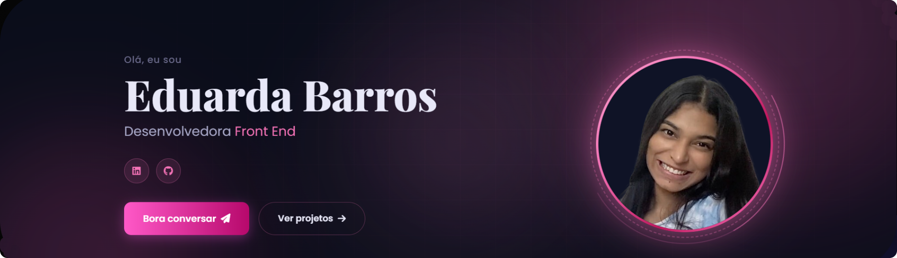

<div align="center">
  <h1 align="center">🌐 Portfólio Pessoal — Eduarda Barros</h1>
</div>



Um portfólio pessoal desenvolvido durante a trilha de **Front-end do Elas+ Tech**, aplicando conceitos de HTML semântico, CSS moderno, JavaScript interativo e dark mode. O projeto foi iniciado na primeira aula e aprimorado continuamente ao longo da trilha.

## 📌 Sobre
Este projeto é uma implementação **focada em aprendizado** de um portfólio profissional completo, explorando:
- **HTML semântico** com estrutura acessível e bem organizada.
- **Dark mode** implementado com JavaScript e variáveis CSS.
- **Animações e interatividade** com IntersectionObserver e scroll suave.
- **Design responsivo** para mobile, tablet e desktop.
- **Overlay de detalhes de projetos** com navegação via hash da URL.

## 🛠 Tech Stack

- [](https://developer.mozilla.org/pt-BR/docs/Web/HTML) - Estrutura semântica e acessível.
- [](https://developer.mozilla.org/pt-BR/docs/Web/CSS) - Layout, animações e responsividade.
- [](https://developer.mozilla.org/pt-BR/docs/Web/JavaScript) - Dark mode, interatividade e animações.
- [](https://fonts.google.com/) - Poppins + Playfair Display.
- [](https://fontawesome.com/) - Biblioteca de ícones.
- [](https://pages.github.com/) - Hospedagem gratuita.

## 🚀 Funcionalidades
- 🌙 **Dark mode** implementado com JavaScript puro.
- 🧭 **Navegação suave** entre seções com scroll animado.
- 🃏 **Overlay de detalhes** dos projetos com navegação por hash de URL.
- 📱 **Layout responsivo** — mobile, tablet e desktop.
- ✨ **Animações com IntersectionObserver** para efeitos suaves no scroll.
- 🧑‍💼 **Seções completas** — Hero, Sobre, Habilidades, Projetos, Experiências e Contato.

## 📂 Estrutura do Projeto
```
portfolio/
├── index.html            # Estrutura da página
├── main.css              # Estilos principais
├── project-detail.css    # Estilos do overlay de projetos
├── script.js             # Interatividade geral
├── project-detail.js     # Lógica do overlay de projetos
├── Eduarda.png           # Foto de perfil
├── eduardabarros-banner.png  # Banner do README
├── Roomify.png           # Preview do projeto Roomify
├── mercedes.png          # Preview do projeto Mercedes F1
├── cine.png              # Preview do projeto CineSystem
└── macbook-landing.bxduO2K2.png  # Preview do projeto MacBook
```

## 🔧 Como rodar

>[!IMPORTANT]
>Não é necessário instalar nada. Basta ter um navegador moderno.

1. **Clone o repositório:**
   ```bash
   git clone https://github.com/eduardabarroscbg/portfolio-Ada.git
   ```
2. **Abra no navegador:**
   ```bash
   open index.html
   ```

Ou acesse diretamente pelo [GitHub Pages](https://eduardabarroscbg.github.io/portfolio-Ada/).

## 🎨 Identidade Visual

| Elemento | Valor | Uso |
|---|---|---|
| 💗 Rosa | `#f472b6` | Cor de destaque principal |
| 🌸 Rosa Escuro | `#be185d` | Gradientes e hover |
| 🌑 Fundo | `#0a0d1a` | Background dark |
| 🌫️ Card | `#111827` | Background dos cards |
| 🔤 Texto | `#e8e8f8` | Texto principal |

## 🎯 O que aprendi
- Aplicar **lógica de programação** na prática com JavaScript puro.
- Implementar **dark mode** com variáveis CSS e toggle via JS.
- Usar **Git e GitHub** para versionamento e controle de versão.
- Publicar um projeto com **GitHub Pages**.
- Criar um **overlay de projetos** com suporte a navegação por hash de URL.
- Boas práticas de **HTML semântico** e acessibilidade.

## 🔗 Links
- [Live Demo](https://eduardabarroscbg.github.io/portfolio-Ada/)
- **GitHub:** [@Eduardabarroscbg](https://github.com/eduardabarroscbg)

---

<div align="center">
Feito com ❤️ por Eduarda Barros
</div>
